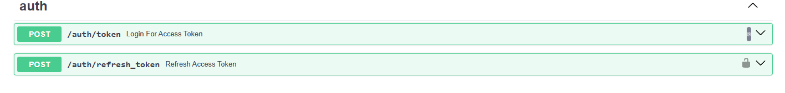
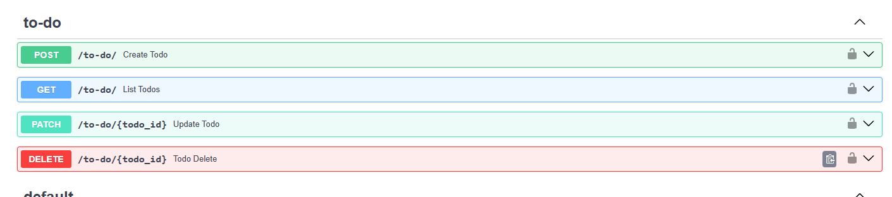

# To-Do List API

https://to-do-api-mnup.onrender.com

A Fastapi api where you can create your tasks and view their status.
task management and authentication:

- _title_: str;
- _description_: str;
- _status_: Todostatus;

_status_ consists in four states that you can set you task in create/upgrade. 

There's no limit o task creation. 

## Features:

- Jwt Authentication
- Crud task management
- Postgresql as Database amd Alembic for migrations
- Automatic Tests
- Docker Production

### Endpoints:
- auth

- user management and database read

- task management

## Techs
- Fastapi: Python backend api structure
    - Sqlalchemy: Python database interations
    - Postgresql: robust database
    - Pydantic: Python data validation
    - Alembic: database alters (migrations)

-  Jwt:
    Json Web Token Authentication

- Docker: development,Postgresql database and app distribuition.
    - Docker Compose: Deployment e setting env instructions

- Tests:
    Pytest

- Enviroitment
    Poetry: install dependencies

## Arquiteture

fast_pr/
    fast_pr/
        routers/
            - auth.py
            - to_do.py
            - users.py
        - app.py
        - database.py
        - models.py
        - schemas.py
        - security.py
    migrations/
        versions/
        env.py
    tests/

### Variables/.env example
#### User:
- DATABASE_URL: user info and task storage address (str)
- SECRET_KEY: user password (str)
- ALGORITHM: use to create hashs (str)
- TOKEN_EXPIRE_MINUTES: time to expire jwt token (int)

#### Database:
- POSTGRES_USER
- POSTGRES_DB
- POSTGRES_PASSWORD

## How Install-Use

First,you need have installed pre-requisites
- Docker
- Docker compose

1.clone
<code>
git clone https://github.com/roossqg/Api-with-fast
cd project...
<code>

2.Create a __.env__ in your repo with  project variables

3.docker:
<code>
docker compose up --build
<code>

